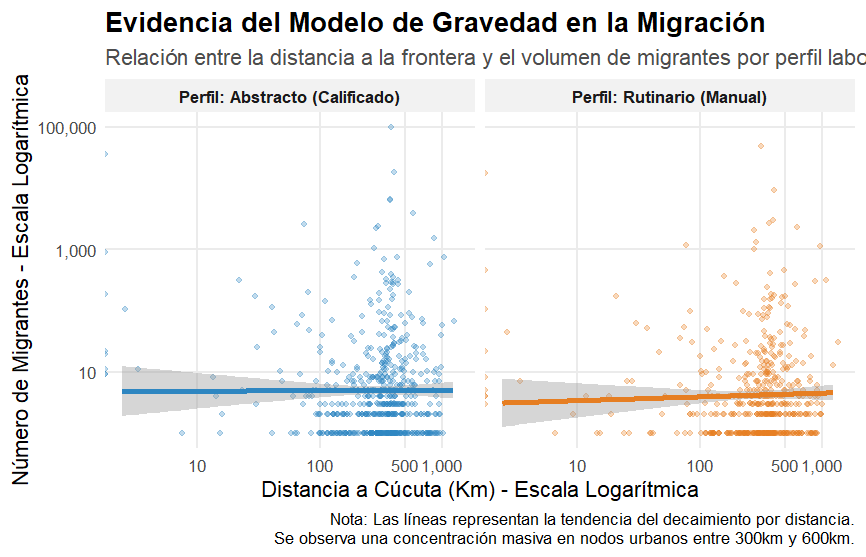

# Análisis de la Migración Venezolana en Colombia: Un Enfoque de Gravedad

Este repositorio contiene el desarrollo de un **Modelo de Gravedad** aplicado al flujo migratorio de venezolanos hacia los municipios de Colombia durante el año 2024. El estudio se centra en identificar cómo la distancia geográfica y la capacidad económica de los destinos influyen en la localización de los migrantes según su perfil laboral.

##  Características del Modelo
- **Estrategia de Identificación:** Uso de la distancia geodésica al Puente Internacional Simón Bolívar (Cúcuta) como factor de fricción espacial.
- **Estimación de PIB Municipal:** Ante la carencia de datos oficiales de PIB a nivel municipal para 2024, se implementó un **Análisis de Componentes Principales (PCA)** sobre variables de infraestructura (acueducto), capital humano y la Medición de Desempeño Municipal (MDM) para realizar un *downscaling* del PIB departamental.
- **Marco Teórico:** Inspirado en la metodología de **Dustmann, Otten, Schönberg & Stuhler (2025)**, segmentando el flujo en tareas **Abstractas (Skilled)** y **Rutinarias (Manuales)**.
- **Método Estadístico:** Estimador **PPML (Poisson Pseudo-Maximum Likelihood)** para manejar la sobredispersión de los datos y garantizar la consistencia de las elasticidades.

##  Hallazgos Principales
- Se confirmó la validez de la Ley de Gravedad con un coeficiente de distancia negativo y significativo.
- Los trabajadores con perfiles **Abstractos** muestran una mayor sensibilidad a la calidad del capital humano local (educación superior).
- El modelo alcanzó un **Pseudo R² de 0.82**, demostrando un alto poder predictivo de las variables seleccionadas.

### Efecto de la Distancia
Relación logarítmica que demuestra el decaimiento del flujo migratorio a medida que aumenta la distancia desde la frontera.



## Estimaciones del Modelo de Gravedad

```text
                                      reg_total      reg_dustmann.1      reg_dustmann.2
                                    Flujo Total Abstracta (Skilled)  Rutinaria (Manual)
Dependent Var.:                 Total_Migrantes     Total_Migrantes     Total_Migrantes
                                                                                       
Log Distancia a Cúcuta     -0.1595*** (0.0040) -0.1787*** (0.0051) -0.1263*** (0.0068)
Log PIB                       1.419*** (0.0048)   1.402*** (0.0061)   1.451*** (0.0081)
Constant                     -6.854*** (0.0655)  -6.467*** (0.0832)  -7.483*** (0.1083)
porcentage_nivel_Superior    0.0161*** (0.0005)  0.0204*** (0.0007)  0.0089*** (0.0009)
MDM_FactorG1-NivelAlto      -0.8101*** (0.0120) -0.9144*** (0.0150) -0.6167*** (0.0203)
MDM_FactorG2-NivelMedioAlto  0.2529*** (0.0214)     0.0383 (0.0269)  0.6100*** (0.0355)
MDM_FactorG3-NivelMedio      0.7310*** (0.0241)  0.1451*** (0.0341)   1.447*** (0.0364)
MDM_FactorG4-NivelMedioBajo -0.3500*** (0.0423) -0.4460*** (0.0533)   -0.1742* (0.0704)
MDM_FactorG5-NivelBajo        1.313*** (0.0418)   1.244*** (0.0527)   1.442*** (0.0696)
___________________________ ___________________ ___________________ ___________________
S.E. type                                   IID                 IID                 IID
Observations                              1,038                 554                 484
Squared Cor.                            0.77364             0.86898             0.84682
Pseudo R2                               0.82451             0.85317             0.81074
BIC                                   103,939.0            57,663.6            36,914.0
---
Signif. codes: 0 '***' 0.001 '**' 0.01 '*' 0.05 '.' 0.1 ' ' 1
```

## Datos del Proyecto

Para facilitar la replicabilidad de este modelo, se incluye el archivo `base_migracion_colombia_procesada.csv`. Junto a los datos para la construcción del PCA para el PIB.
**Diccionario de datos:**
- `CODIGO_DANE_MPIO_HOSPEDAJE`: Código único del municipio (DANE).
- `Tipo_Tarea`: Clasificación laboral (Abstracta/Rutinaria) según Dustmann (2025).
- `Total_Migrantes`: Flujo de entradas venezolanas en 2024.
- `Distancia_Frontera_Km`: Distancia geodésica al Puente Simón Bolívar (Cúcuta).
- `PIB_Municipal_Estimado`: Valor agregado estimado mediante PCA.
- `MDM_Texto`: Categoría de desempeño municipal (DNP).
